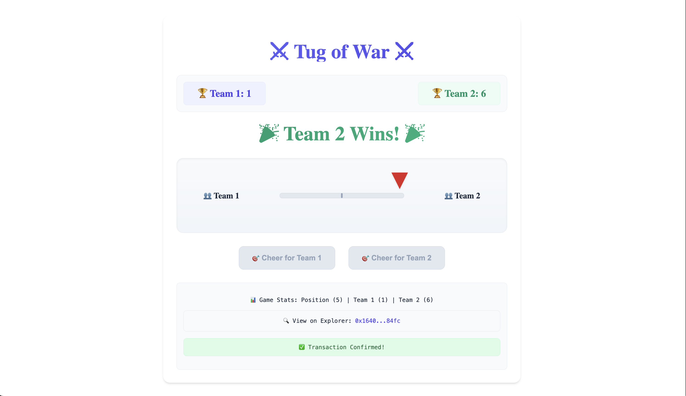

# Tug of War Game

A blockchain-based online tug-of-war game implemented with Solidity smart contracts and React frontend. Players can choose to support Team 1 or Team 2 by sending transactions to cheer for their team.

<div style="display: flex; justify-content: center;">
    
</div>

## Game Rules

1. Players connect their wallet to participate
2. Each player can choose to support either Team 1 or Team 2
3. Supporting a team requires sending a transaction
4. The rope position moves based on the cumulative score difference
5. A team wins when their score exceeds the other team by maxScoreDifference points
6. The game can be reset by the contract owner


## Project Architecture

- Smart Contract: Written in Solidity, based on Foundry framework
- Frontend: React + TypeScript + Wagmi + Viem
- Network: Monad Testnet

## Contract Features

- `pull(bool isTeam1)`: Cheer for the selected team
- `getWinStatus()`: Get current game status
- `reSet(uint8 _maxScoreDifference)`: Reset game (admin only)

## Quick Start

### Clone the Repository

```bash
git clone https://github.com/danielbui12/monad-bootcamp-tug-of-war-game.git
cd monad-bootcamp-tug-of-war-game
pnpm install --frozen-lockfile
```

### Project Structure

```
├── README.md
├── app
│   ├── biome.json
│   ├── index.html
│   ├── package.json
│   ├── pnpm-lock.yaml
│   ├── src
│   │   ├── App.tsx
│   │   ├── contracts.ts
│   │   ├── index.css
│   │   ├── main.tsx
│   │   ├── vite-env.d.ts
│   │   ├── wagmi.ts
│   │   └── wallets.tsx
│   ├── tsconfig.json
│   ├── tsconfig.node.json
│   └── vite.config.ts
├── foundry.toml
├── package.json
├── pnpm-lock.yaml
├── remappings.txt
├── script
│   └── Deploy.sol
├── src
│   └── contracts
│       └── TugWar.sol
└── test
    └── unit
        └── TugWar.test.sol
```

### Contract Part

1. Install Foundry
```bash
curl -L https://foundry.paradigm.xyz | bash
foundryup
```

2. Prepare environment variables
```bash
cp .env.example .env
```

3. Run Tests
```bash
pnpm test:unit
```

4. Deploy Contract
```bash
# Edit .env file and set environment variables
MONAD_TESTNET_DEPLOYER_PRIVATE_KEY=your_private_key
MONAD_TESTNET_RPC=https://testnet-rpc.monad.xyz

# Deploy to Monad testnet
pnpm deploy:monad_testnet
```

### Frontend Part

1. Install dependencies
```bash
cd app
pnpm install --frozen-lockfile
```

2. Start Development Server
```bash
pnpm run dev
```

## Technical Details

### Smart Contract
- Written in Solidity 0.8.0
- Uses Foundry for development and testing
- Key state variables:
  - `ropePosition`: Current position of the rope (-5 to 5)
  - `team1Score` & `team2Score`: Current scores
  - `maxScoreDifference`: Points needed to win

### Frontend
- Built with React and TypeScript
- Uses Wagmi for Monad interactions
- Features:
  - Real-time score updates
  - Visual rope movement
  - Wallet connection management
  - Transaction status display
